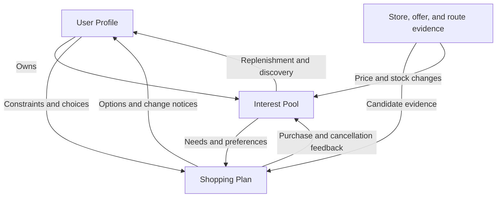

# 🛒 CartCompass — A Personalized Shopping Agent for Everyday Life in the U.S.

> An agent that remembers where you live, how you travel, and what you need—helping you decide **what to buy, where to buy it, when to buy it, and whether to shop in person or use delivery.**

CartCompass is a proposed shopping assistant built around **Jac**, with three connected modules: **User Profile, Interest Pool, and Shopping Plan**. It combines everyday needs, product information, and practical transportation constraints to produce shopping plans that are explainable, adjustable, and responsive to change.

**Status: Design proposal v0.1.** This README describes planned functionality and architecture, not a completed implementation. Stores, prices, availability, and routes in the examples are simulated. Implementation milestones are listed in the [roadmap](#roadmap).

## Table of Contents

- [Overview and Design Principles](#overview-and-design-principles)
- [Three Core Modules](#three-core-modules)
- [Interactions and Feedback](#interactions-and-feedback)
- [Shopping Planning Rules](#shopping-planning-rules)
- [Interest Updates and Proactive Reminders](#interest-updates-and-proactive-reminders)
- [System Architecture](#system-architecture)
- [Data Sources and Refresh Strategy](#data-sources-and-refresh-strategy)
- [Example Interactions](#example-interactions)
- [Proposed Project Structure](#proposed-project-structure)
- [Core Workflow Pseudocode](#core-workflow-pseudocode)
- [Configuration](#configuration)
- [Demo and Evaluation](#demo-and-evaluation)
- [Roadmap](#roadmap)
- [Getting Started](#getting-started)
- [Design Decisions](#design-decisions)
- [Course Reference](#course-reference)

## Overview and Design Principles

Shopping involves more than comparing product prices. A nearby store may be out of stock. A cheaper store may require multiple bus transfers. Delivery can add fees. A larger package may have a lower unit price but be too heavy to carry or too large to use before it expires.

CartCompass aims to reduce this decision burden, especially for people who do not own a car, rely on walking or public transit, and regularly purchase groceries and household essentials.

A user might say:

> “I need milk, eggs, laundry detergent, and rice this week. I don't have a car, I'm free on Saturday afternoon, and my budget is $60. Delivery is fine for the rice and detergent if they're too heavy.”

The agent combines persistent preferences with available product information to propose a small set of comparable plans. Each plan explains its shopping list, estimated cost, time commitment, and uncertainties.

Four principles guide the design:

1. **Start with the user's circumstances.** Location, transportation, budget, and carrying capacity determine whether a plan is practical.
2. **Optimize the whole shopping trip.** Compare the complete basket, store combinations, transportation expenses, and delivery fees.
3. **Maintain memory through feedback.** Purchases, stockouts, postponements, and dislikes should produce different updates.
4. **Make recommendations explainable and traceable.** Show the reasoning and data timestamps, and label unknown availability and estimated charges.

### Project Focus

The core technical work includes matching product specifications, checking store availability and delivery conditions, comparing total basket costs, enforcing transportation and carrying constraints, selecting alternative plans, and replanning when conditions change.

Conversation and reminders provide access to these capabilities. The three-module architecture connects persistent user preferences, evolving shopping interests, and concrete shopping decisions through bidirectional feedback and event synchronization.

## Three Core Modules

### 1. User Profile — `UserProfile`

The profile stores long-term information that affects shopping decisions. Users can inspect and modify it at any time.

| Information | Examples | Planning Impact |
|---|---|---|
| Common locations | Home, campus, workplace | Determine outbound and return routes; support shopping on the way home |
| Location precision | Neighborhood or full address | Use an approximate area for initial filtering; verify exact delivery coverage when needed |
| Transportation | Walking, bus, car, bicycle, rideshare | Select routes and estimate round-trip time and cost |
| Travel limits | At most one transfer; no more than 15 minutes of walking | Exclude inconvenient routes |
| Carrying capacity | Up to 6 kg; access to a shopping trolley | Decide whether heavy items are practical to collect in person |
| Availability | Saturday, 2–5 p.m. | Match trips with store hours and delivery windows |
| Budget | Per-trip or weekly spending limit | Constrain estimated total spending |
| Product preferences | Brands, package sizes, flavors, dietary restrictions | Match products and acceptable substitutes |
| Memberships and discount eligibility | Active membership; eligibility for first-order offers | Apply only discounts the user can actually use |
| Trade-off preferences | Lower cost, less time, fewer transfers | Rank feasible plans |

**Persistent preferences and current-trip constraints are stored separately.** “I don't want to take the bus this week” affects the current plan. “Prefer delivery from now on” changes the default. Automatically learned preferences cannot override user-locked conditions.

### 2. Shopping Interest Pool — `InterestPool`

The interest pool tracks immediate needs, recurring purchases, products worth watching, and items the user may want to explore.

| Category | Meaning | Example | Default Behavior |
|---|---|---|---|
| `NEED` | Explicit purchase intent | Dish soap needed tomorrow | Include in the list to be planned |
| `REPLENISH` | Items that may need regular replacement | Milk, eggs, paper towels | Ask when the estimated replenishment date approaches |
| `WATCH` | Products awaiting a suitable price or availability | An air fryer below a target price | Notify the user about qualifying price drops or restocks |
| `DISCOVER` | Suggested products related to existing preferences | A new yogurt flavor or small ingredient package | Show in a recommendation area; add to the shopping list only after confirmation |

**Required purchases and optional recommendations remain separate.** Discovery suggestions do not automatically consume the budget. The agent does not add unnecessary products simply to reach a delivery threshold.

Each interest item includes:

| Attribute | Meaning |
|---|---|
| `product_spec` | Product type, brand, package size, quantity, and substitution rules |
| `kind` / `status` | Category and active, paused, or archived state |
| `priority` / `needed_by` | Purchase priority and latest acceptable acquisition time |
| `target_price` | Desired price threshold for a specified package or quantity |
| `interest_score` | Interest in an optional product; does not replace explicit need priority |
| `last_purchased_at` | Most recent user-confirmed purchase time |
| `replenishment_interval` | User-defined or historically estimated replenishment interval |
| `source` / `confidence` | User input, purchase history, or system inference, with inference confidence |
| `feedback_history` | Reasons such as too expensive, unavailable, disliked, or not needed yet |
| `locked` / `snoozed_until` | Protection from automatic changes and reminder snooze time |

Product needs are stored separately from store offers. For example, “buy one gallon of milk” is a need; each store's price, package, availability, and fulfillment conditions belong to a separate `Offer`.

### 3. Shopping Plan — `ShoppingPlan`

A shopping plan turns needs into actionable arrangements:

- **What to buy:** Products, quantities, specifications, acceptable substitutes, and unmet needs.
- **Where to buy:** One or more stores or delivery providers.
- **How to obtain the items:** In-store shopping, supported pickup options, delivery, or a combination.
- **When to obtain them:** Suggested departure and return times or available delivery windows.
- **What it costs:** A breakdown of merchandise, discounts, taxes, transportation, and delivery-related charges.
- **Why the plan is recommended:** Trade-offs, supporting evidence, and uncertainty.

The agent presents up to three options: **cost-first, convenience-first, and balanced**. It does not manufacture additional options when only one feasible plan exists.

Plan states follow `DRAFT → PROPOSED → ACCEPTED → IN_PROGRESS → COMPLETED`, with additional `CANCELLED` and `NEEDS_REVIEW` states. Individual items track purchased, unavailable, postponed, or canceled outcomes, allowing a trip to be partially completed.

## Interactions and Feedback

The three modules communicate in both directions, producing six interactions.

| Direction | Example Trigger | System Behavior |
|---|---|---|
| User → Interest Pool | “Watch this coffee and tell me when it's below $12.” | Create a watch item with a target price |
| Interest Pool → Shopping Plan | Several essentials are due, or the user requests a weekly trip | Gather needs, query offers, and generate candidates |
| Shopping Plan → Interest Pool | Milk was purchased, but paper towels were unavailable | Update the milk purchase date; retain the unmet paper towel need |
| User → Shopping Plan | “I can't go on Saturday. Use delivery instead.” | Recompare options under current-trip constraints |
| Shopping Plan → User | A key product becomes unavailable before departure | Explain the change and propose alternatives |
| Interest Pool → User | A watched product drops in price or replenishment may be due | Send a reminder supported by available evidence |

### Updates Based on Feedback Reasons

| User Feedback | Update |
|---|---|
| “I was too busy to shop this week.” | Reschedule without reducing product interest |
| “That's too expensive.” | Try a cheaper option or substitute for this trip; let the user decide whether to change the long-term target price |
| “The store was out of stock.” | Record the observation, preserve the need, and check other channels |
| “I still have some at home.” | Postpone replenishment and adjust inventory or interval estimates |
| “I tried it and didn't like that flavor.” | Reduce recommendations for that flavor without rejecting the entire category |
| “The trip was too inconvenient.” | Prioritize convenience for the current plan; ask whether to save this preference |
| “I already bought it somewhere else.” | Mark the need as satisfied and avoid duplicate reminders |

### Preventing Update Loops

- Assign each action a unique event ID and make feedback processing idempotent to avoid counting a purchase twice.
- Batch price and availability updates; replan only when feasibility or recommendations materially change.
- Refresh draft plans automatically. Mark accepted plans as `NEEDS_REVIEW` when substantive changes occur and show the differences.
- Keep purchased items out of the current shopping list while preserving their long-term replenishment records.
- Respect locked conditions and explicit instructions over inferred preferences.

## Shopping Planning Rules

### 1. Identify Needs and Hard Constraints

Extract products, quantities, deadlines, budget, transportation, and substitution rules. Clarify missing information that affects feasibility and use saved defaults for the rest.

Check dietary restrictions, required specifications, transportation access, store hours, delivery coverage, arrival deadlines, and user-defined spending limits. Unknown inventory is not treated as confirmed stock, and unknown fees are not treated as zero.

If no plan meets all requirements, identify the unmet needs and explain why. Offer possible adjustments, such as a different package size, an additional trip, or postponing a nonurgent item, without silently relaxing constraints.

### 2. Calculate Total Basket Cost

```text
Estimated out-of-pocket cost
  = merchandise subtotal - eligible discounts
  + applicable taxes and deposits
  + delivery fees, service fees, and user-configured estimated tips
  + transportation and parking costs
```

Evaluate delivery thresholds, minimum order amounts, membership discounts, promotion stacking rules, and store-specific prices using the relevant offers. Show ranges for charges that cannot be verified; checkout totals still require confirmation.

Display both unit price and purchase cost. A larger package may be cheaper per unit but exceed the budget, be difficult to carry, or create waste.

### 3. Evaluate Convenience

Distance is one consideration alongside:

- Round-trip travel, waiting, transfers, and shopping time.
- Walking distance after shopping, carrying weight, and the number of separate trips.
- Whether a pickup option supports the user's transportation mode and whether someone can receive a delivery.
- Transport duration and suitable handling for refrigerated or frozen items.
- Opportunities to shop along a route from campus or work.

For public transit users, actual accessibility and the return trip matter more than straight-line distance alone.

### 4. Compare Candidate Plans

The MVP limits its search to one city, a small set of stores, and at most two fulfillment channels. It enumerates and ranks bounded candidate combinations rather than attempting unrestricted route optimization.

For plans satisfying the same required needs, a possible ranking function is:

```text
Plan score (lower is better)
  = w_cost   × normalized total cost
  + w_time   × normalized active time
  + w_effort × travel and carrying burden
  + w_risk   × data uncertainty
```

Map each metric to a 0–1 range using fixed reference scales, with weights summing to 1. Check hard constraints first: a low price cannot offset a missed deadline or exceeded carrying limit. Present incomplete plans separately rather than ranking them as the best complete solution.

Separate delivery lead time from the user's active time. Timely arrival is a feasibility requirement; two days awaiting a shipment do not equal two days spent traveling.

### 5. Recheck Conditions and Explain Trade-offs

Explain the recommended option and alternatives, including the sources of cost differences. For example:

> “Have the heavy items delivered and buy groceries nearby. This costs about $4 more than buying everything in person but reduces your carrying load by about 5 kg. Delivery charges still need to be confirmed at checkout.”

Refresh evidence and replan when prices, inventory, or delivery windows become invalid. The MVP provides shopping lists, route references, and merchant links. Users complete payment and report actual purchase outcomes.

## Interest Updates and Proactive Reminders

Updates are triggered by user actions, refreshes when the app opens, and scheduled background checks. Background checks require a running service. The MVP starts with manual refresh and in-app reminders; background scheduling is a later milestone.

| Trigger | Reminder | Follow-up |
|---|---|---|
| A purchase deadline approaches | Required items still outstanding | Include them in the next planning request |
| Estimated replenishment is due | “You may be running low on milk. Add it?” | Add a need after confirmation; do not claim to know household inventory |
| A watched product reaches its target price | Price, package, eligibility, and observation time | Let the user add it or keep watching |
| A watched item returns to stock | Relevant store or delivery channel | Provide the channel and verify freshness |
| A relevant new product is found | Connection to existing preferences | Place it in the discovery area |
| An accepted plan's conditions change | Stockout, price increase, or unavailable delivery window | Show the change and alternatives |

Discovery operates on the available product catalog or connected sources. Label a product as newly released only when supported by reliable release or listing evidence; otherwise describe it as something the user has not tried.

Limit discovery recommendations, support quiet hours and snoozing, and deduplicate notifications about the same event. Repeatedly ignored reminders reduce notification frequency. Explicit negative feedback updates preferences. A single purchase does not automatically imply lasting interest.

## System Architecture

### Graph Model

The proposed architecture uses Jac graph models and walkers. Exact syntax and dependency versions will be validated during implementation.



| Node | Stored Information |
|---|---|
| `UserProfile` | Locations, transportation, budget, preferences, and constraints |
| `InterestPool` / `InterestItem` | Long-term interests, replenishment patterns, and immediate needs |
| `Product` | Standardized product identity, specifications, units, and category |
| `Store` / `Offer` | Stores, fulfillment channels, timestamped prices, and availability observations |
| `ShoppingPlan` / `PlanItem` | Plans, cost breakdowns, need coverage, and item outcomes |
| `FulfillmentLeg` | Conditions for one shopping trip segment or delivery order |
| `FeedbackEvent` / `Reminder` | User feedback and deduplicated reminders |

An `InterestItem` connects to products through `Wants`. An `Offer` connects to a product through `ForProduct` and a store through `AtStore`. Plans connect to needs through `Satisfies` and offers through `UsesOffer`.

Feedback follows these relationships to update the relevant product, store experience, or preference, keeping a local issue from incorrectly affecting the entire profile.

### Walker Responsibilities

| Walker | Responsibility |
|---|---|
| `update_profile` | Save persistent preferences and current-trip constraints |
| `update_interest` | Create, modify, pause, or archive interests |
| `refresh_offers` | Query providers and store prices, availability, and timestamps |
| `build_candidates` | Match products and construct in-store, delivery, and mixed candidates |
| `plan_shopping` | Check constraints, calculate total costs, and rank options |
| `plan_action` | Accept, modify, cancel, or record item outcomes |
| `feedback` | Update needs and preferences according to feedback reasons |
| `discover_products` | Select potentially relevant products from the catalog |
| `check_reminders` | Check replenishment, price-drop, and plan-change events |
| `sync` | Deduplicate and batch events; trigger replanning when needed |
| `chat` | Interpret intent and route requests to the appropriate operation |

### LLM and Deterministic Logic

The LLM interprets ambiguous requests, assists with product matching, classifies feedback, and explains recommendations. Structured tools query external data. Deterministic logic handles arithmetic, discount eligibility, time and weight constraints, ranking, and reminder deduplication.

Suggested substitutes must pass specification and constraint checks. Missing prices, routes, or inventory remain unknown rather than being invented by the model.

## Data Sources and Refresh Strategy

Real data integration is a significant dependency. The project does not assume that every U.S. retailer provides an accessible real-time API.

| Data | MVP Approach | Possible Extension |
|---|---|---|
| Profiles and needs | Manual input and conversation updates | Optional purchase-history import |
| Products, prices, and stock | Fixed mock dataset and manually maintained snapshots | Selected accessible, permitted sources or retailer APIs |
| Store locations and hours | A small set of configured stores | Mapping and places services |
| Routes and travel times | Fixed routes for demo scenarios | Routing and public transit data |
| Delivery coverage and fees | Simulated areas, time windows, and fee rules | Address-specific delivery verification |
| Product discovery | A limited catalog with product tags | Regular catalog and release updates |

Each external record stores its `source`, `observed_at`, applicable store or area, data mode, and validity period. Expired records are marked for refresh. If a query fails, cached information may be displayed with its timestamp, but not presented as current live data.

The prototype focuses on groceries and household consumables in one city. Live integration starts with one verifiable source. The interface always distinguishes `mock` and `live` data.

Use location information only as needed: an approximate area supports initial exploration, while a full address is requested for exact routing or delivery coverage. Keep credentials in environment configuration and use fictional addresses in demos and public repository data.

## Example Interactions

These examples illustrate intended behavior. All numeric values are simulated and do not represent current merchant conditions.

### 1. Create a Profile and Add Needs

> **User:** I live in Ann Arbor and usually take the bus. I don't have a car, can carry up to 6 kg, and spend around $60 per week on groceries. I like Asian ingredients.
>
> **Agent:** I've saved your transportation mode, carrying limit, weekly budget, and food preferences. You can start with your neighborhood and provide a full address later if we need to verify delivery.
>
> **User:** I need milk, eggs, rice, and laundry detergent by Saturday.
>
> **Agent:** I've added those needs. Rice and detergent may be heavy, so I'll compare in-store shopping and delivery. What size bag of rice do you need, and are other brands acceptable?

### 2. Compare Shopping Plans

Assume product specifications are confirmed, all required items are matched, and all three options meet the deadline. The budget is $60 and the carrying limit is 6 kg.

| Cost or Constraint | A: All In-Store | B: All Delivered | C: Groceries In-Store, Heavy Items Delivered |
|---|---:|---:|---:|
| Merchandise after discounts | $42 | $45 | $43 |
| Estimated taxes | $2 | $2 | $2 |
| Transportation | $2 | $0 | $2 |
| Delivery and service fees | $0 | $5 | $3 |
| Estimated tip | $0 | $4 | $2 |
| **Estimated total** | **$46** | **$56** | **$52** |
| Active time | 95 min | 10 min | 40 min |
| Load carried from stores | 9 kg | None | 3 kg |
| Within carrying limit | No | Yes | Yes |

> **Agent:** Option A exceeds your 6 kg carrying limit, so I won't recommend it as executable. Option C is the balanced recommendation: it meets your needs within budget and saves $4 compared with B, but requires about 40 minutes outside. Choose B if convenience matters more this week. Taxes and delivery-related charges are estimates and need verification before checkout.

### 3. Record Purchase Outcomes

> **User:** I bought the milk and eggs, and the rice arrived. The detergent was out of stock.
>
> **Agent:** I've recorded the three completed purchases. Detergent remains on your shopping list, and I'll check other channels. This stockout will not reduce its priority.

### 4. Maintain the Interest Pool

> **User:** Keep an eye on unsweetened yogurt. You can suggest similar new products, but don't automatically add them to my shopping list.
>
> **Agent:** I've added it to your interest pool. Relevant suggestions will appear separately with a reason and offer timestamp. They'll enter the shopping budget only after you confirm them.

### 5. Replan After a Change

> **Agent:** The delivery window selected for your heavy items is no longer available. The replacement window is after your deadline, so your plan needs review. Another provider could meet the deadline for an estimated $3 more. Would you like to use that option?

## Proposed Project Structure

The following directories and files are planned and remain to be implemented.

| Path | Responsibility |
|---|---|
| `main.jac` | Application entry point and conversation routing |
| `models/` | Graph models for users, interests, products, offers, plans, and events |
| `profile/` | Persistent profiles and current-trip constraints |
| `interests/` | Interest management, replenishment estimates, and discovery |
| `planning/` | Matching, constraints, candidates, costs, and ranking |
| `providers/` | Product, location, route, and delivery adapters |
| `feedback/` | Feedback classification, purchase outcomes, and preference updates |
| `sync/` | Event idempotency, cache refresh, and replanning triggers |
| `notify/` | In-app reminders and later background scheduling |
| `ai/` | Structured parsing, matching assistance, and explanations |
| `data/mock/` | Fictional users, catalogs, stores, and change events |
| `ui/` | Profile forms, interest pool, and plan comparison views |
| `tests/` | Cost, constraint, feedback, and event replay validation |

## Core Workflow Pseudocode

This pseudocode describes intended logic; it is not validated executable Jac code.

```text
plan_shopping(user, request):
    context = merge_profile_and_session_constraints(user, request)
    needs = collect_confirmed_needs(user.interest_pool, request)
    offers = providers.query(needs, context.location)
    offers = validate_specs_sources_and_freshness(offers)

    candidates = build_store_delivery_and_mixed_plans(needs, offers)
    evaluated = compute_cost_time_weight_and_coverage(candidates, context)
    feasible = enforce_hard_constraints(evaluated, context)

    if feasible is empty:
        return explain_unmet_needs_and_possible_relaxations(evaluated)

    alternatives = select_cost_convenience_balanced_options(feasible)
    return explain_with_evidence(alternatives)

record_feedback(event):
    if event.id already processed:
        return
    update_plan_item_outcomes(event)
    update_interest_by_reason(event)
    mark_event_processed(event.id)
    enqueue_replan_only_if_needed()
```

## Configuration

These are proposed application settings, not an official Jac configuration schema. The file format will be selected during implementation.

| Setting | Initial Default | Purpose |
|---|---|---|
| `data_mode` | `mock` | Distinguish demonstration data from live data |
| `timezone` | `America/New_York` | User-editable time zone for trips and reminders |
| `max_fulfillment_channels` | 2 | Bound the initial search space |
| `max_plan_options` | 3 | Limit the number of presented plans |
| `max_discovery_items_per_week` | 3 | Control recommendation frequency |
| `reminder_cooldown_hours` | 24 | Avoid repeated reminders when conditions have not materially changed |
| `allow_substitutions` | Ask per item | Do not assume permission to change brands, specifications, or dietary requirements |
| `auto_purchase` | `false` | Users complete purchases on merchant pages in the initial version |

Configure cache validity separately for prices, availability, and routes by source. A single freshness threshold does not represent the reliability of every data type.

## Demo and Evaluation

### Reproducible Demo

The proposed demo uses a fixed dataset covering one city, three stores, approximately 30 product offers, and a small set of delivery rules. Dataset size may be adjusted as development progresses.

The demonstration will:

1. Create a profile for a user without a car.
2. Add groceries and heavy household items.
3. Compare in-store, delivery, and mixed plans.
4. Inject a stockout or price change and update the plan.
5. Record a partially completed shopping list.
6. Update the interest pool and produce a price-drop or replenishment reminder.

### Baselines and Metrics

| Baseline or Ablation | Evaluation Question |
|---|---|
| Nearest-store-first | Does distance alone overlook availability, fees, and carrying limits? |
| Lowest listed price per item | Can splitting purchases across stores increase total basket cost? |
| No persistent profile | Does remembering travel and carrying constraints reduce unsuitable plans? |
| No feedback updates | Can feedback prevent repeated suggestions for purchased or explicitly disliked items? |

Measure required-item coverage, hard-constraint violations, estimated total basket cost, active time, the rate of recovering a feasible plan after a change, and duplicate reminders. Compare costs only across plans satisfying the same needs and constraints.

Key acceptance scenarios include known budget overruns, excessive carrying weight, ineligible membership discounts, unknown inventory, stockouts across all channels, duplicate purchase events, and invalid delivery windows. When no feasible solution exists, the system should explain why rather than produce a superficially complete but unusable plan.

## Roadmap

### Phase 1: Core Feedback Loop — MVP

- [ ] Persist user profiles, interests, and plan states.
- [ ] Convert natural-language requests into structured shopping needs.
- [ ] Implement mock product, store, route, and delivery adapters.
- [ ] Compare costs and constraints for in-store, delivery, and mixed plans.
- [ ] Explain recommendations and record individual purchase outcomes.
- [ ] Support manual refresh and in-app price-drop and replenishment reminders.
- [ ] Build basic profile, interest pool, and plan comparison interfaces.

### Phase 2: Dynamic Updates and Live Data

- [ ] Integrate one verified live source with explicitly documented coverage.
- [ ] Handle stale data, query failures, and plan change comparisons.
- [ ] Add scheduled refresh, notification deduplication, and quiet hours.
- [ ] Add catalog-based discovery and preference updates from feedback.
- [ ] Run fixed scenario replays and baseline comparisons.

### Phase 3: Future Extensions

- [ ] Extract purchase records from user-provided receipts.
- [ ] Support shared household needs and budgets.
- [ ] Expand route planning across more stores.
- [ ] Integrate verifiable shopping carts with user confirmation before purchase.

The course project prioritizes Phase 1, with selected Phase 2 features as time permits. Nationwide retailer coverage, comprehensive real-time inventory, and automatic payment are outside the initial delivery commitment.

## Getting Started

The running app is a chat page. `main.jac` mounts `ui/chat.cl.jac`. Each message goes through `harness/pipeline.jac`, which currently returns the conversation unchanged, and `server/llm.jac` makes one OpenAI-compatible chat-completions call. `server/chat.jac` is the walker the page calls. `config.jac` holds the model settings.

`models/` holds the graph model: profile, interests, catalog (`Product`, `Store`, `Offer`), plans (`ShoppingPlan`, `FulfillmentLeg`, `PlanItem`), and events (`FeedbackEvent`, `Reminder`), with edges and helpers in `models/graph.jac`. `providers/mock.jac` loads the fictional dataset in `data/mock/catalog.json`, and `feedback/apply.jac` applies feedback reasons idempotently. These folders are reserved for the later shopping logic and are empty for now: `profile/`, `interests/`, `planning/`, `sync/`, and `notify/`.

```bash
python3 -m venv .venv
source .venv/bin/activate
pip install jaclang jac-client
cp .env.example .env
jac start
jac test
```

Open http://localhost:8000. Put your key in `.env`. The checked-in example points at DeepSeek (`https://api.deepseek.com`, model `deepseek-chat`). `jac start` reads `.env` from the project directory; restart it after changing the file. Without `LLM_API_KEY`, the page still opens and the reply tells you the key is missing.

## Design Decisions

**Why keep a separate interest pool?** A shopping list describes current needs. An interest pool also retains replenishment patterns, products awaiting discounts, and categories the user wants to explore, creating continuity across trips.

**Why separate essentials from discovery?** Essentials prioritize obtaining required items on time. Discovery depends on preferences and optional spending. Separating them protects the budget for necessities.

**Why not delegate all planning to an LLM?** Arithmetic, discount eligibility, and constraint validation need reproducible results. The LLM is used for interpreting needs and explaining decisions.

**Why start with mock data?** A controlled dataset makes it possible to validate planning and feedback before integrating external services. It also supports reproducible course demonstrations and makes the boundaries of live functionality explicit.

**Why does a purchase not automatically increase interest?** Buying rice may simply replenish a staple, and trying a flavor does not imply liking it. Purchases update factual history; explicit feedback is the main signal for preference changes.

## Course Reference

Course repository: [marsninja/CSE449-F26](https://github.com/marsninja/CSE449-F26).

This document is a project proposal. Final scope and technology choices remain subject to the course requirements and team implementation decisions.
